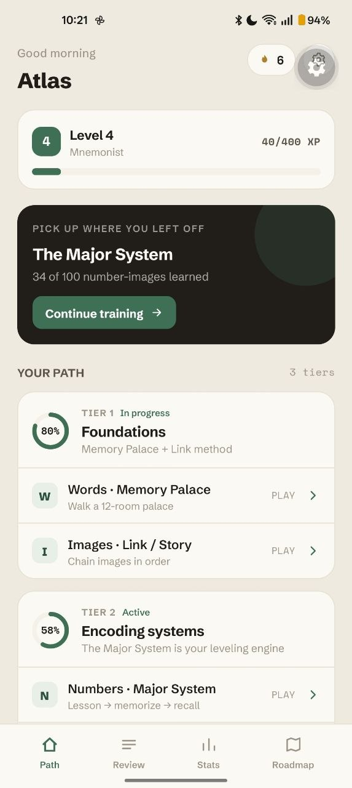

# Mnemos

A memory-training game for iOS, Android and web, built with Expo + React Native.
It teaches the techniques competitive memory athletes use — the **memory palace**,
the **Major System** for numbers, and **Rule-of-Five spaced repetition** — through
short, playable rounds. Built from the research in [`research.md`](./research.md)
and the Mnemos design (Claude Design).

It is solo and fully local: all progress (XP, streak, spaced-repetition deck,
discipline bests, history) is stored on-device with AsyncStorage. No backend, no
accounts.

<p align="center">
  
</p>

## Screens

- **Path (Home)** — level/XP, a resume card, and a 3-tier progression of disciplines.
- **Numbers** — a Major System lesson, then a timed memorize → keypad-recall →
  score round (beginner / intermediate / advanced).
- **Cards** — Speed Cards: flip through a shuffled deck one card at a time (with a
  PAO-style word per card), then reorganize the reshuffled deck back into order.
  Includes an editable 52-card system and a 1–4 cards-per-story selector.
- **Palace** — stash words at 12 rooms of a memory palace, then walk it back.
- **Images** — Link/Story: memorize a sequence of images, then tap them back in order.
- **Review** — Rule-of-Five spaced repetition over all 100 number-images; cards
  come due on real calendar days (now, +1 day, +1 week, +1 month, +3 months).
- **Stats** — level, streak, Major System mastery, weekly activity, bests, history.
- **Roadmap** — the encoding upgrade path and planned features.
- **Settings** — your display name, haptics, daily reminder, reduce-motion, reset progress.

## Run it on your device

This is a personal-use app — it is **not published to the app stores**. Clone it
and run it yourself:

```bash
git clone https://github.com/hasangilak/elephantmind.git mnemos
cd mnemos
npm install
npx expo start        # press w for web, or scan the QR with Expo Go
```

- **Quick try (Expo Go):** install **Expo Go** on your phone — it must support
  **Expo SDK 56** (update it if older) — then scan the QR from `npx expo start`.
  Everything works except the daily reminder, which Expo Go can't run.
- **Full features (dev build):** for the daily reminder, build a development
  client instead of Expo Go (needs Android Studio / Xcode):
  ```bash
  npx expo run:android   # or: npx expo run:ios
  ```

A fresh install starts empty — level 1, no streak, all 100 number-images "new" —
and builds real progress as you play.

## Project layout

```
src/
  app/             expo-router routes ((tabs) + numbers / cards / palace / images / settings)
  engine/          pure game logic (digits/scoring, palace, spaced repetition, leveling)
  data/            Major System peg table + static game content
  state/           Zustand progress store (AsyncStorage) + ephemeral UI store
  components/      shared UI (Icon, Card, Ring, Toast, tab bar, layout helpers)
  theme/           design tokens (colors, fonts, radii)
```

## Scripts

```bash
npm test           # jest — engine/data unit tests
npm run typecheck  # tsc --noEmit
npm run lint       # expo lint
```
